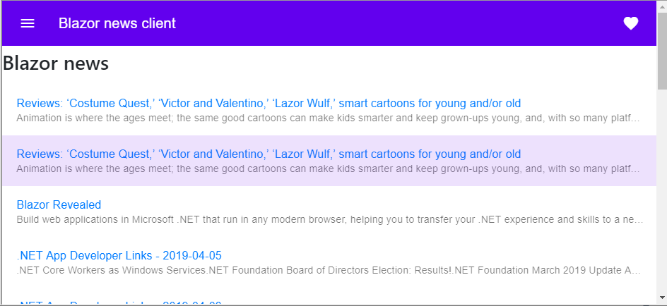
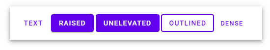

#  

## Material Design components for Blazor and Razor Components
[](https://www.nuget.org/packages/MatBlazor/)
[](https://gitter.im/MatBlazor/community?utm_source=badge&utm_medium=badge&utm_campaign=pr-badge)
[](https://github.com/SamProf/MatBlazor/stargazers)
[](https://github.com/SamProf/MatBlazor/issues)
[](https://www.matblazor.com)
[](LICENSE)
[](https://www.paypal.com/cgi-bin/webscr?cmd=_s-xclick&hosted_button_id=9XT68N2VKWTPE&source=url)
[](https://www.patreon.com/SamProf)

MatBlazor comprises a range of components which implement common interaction patterns according to the Material Design specification.


## Demo and Documentation
- [MatBlazor.com - Documentation and demo website](https://www.matblazor.com)
- [MatBlazor - Documentation and demo website - ClientSideBlazor](https://samprof.github.io/MatBlazor/)
- [BlazorFiddle example](https://blazorfiddle.com/s/matblazor-news-client)
- [BlazorBoilerplate](https://github.com/enkodellc/blazorboilerplate) -  A Real World Starter App with Authentication / Authorization built with MatBlazor. [Demo](https://blazorboilerplate.com).





## Prerequisites

Don't know what Blazor is? Read [here](https://github.com/aspnet/Blazor)

Complete all Blazor dependencies.

- .NET Core 3.1
- Visual Studio 2019 with the ASP.NET and web development workload selected.

## Installation 

Latest version in here:  [](https://www.nuget.org/packages/MatBlazor/)


To Install 

```
Install-Package MatBlazor
```
or 
```
dotnet add package MatBlazor
```

For client-side and server-side Blazor - add script section to index.html or _Host.cshtml (head section) 

```html
<script src="_content/MatBlazor/dist/matBlazor.js"></script>
<link href="_content/MatBlazor/dist/matBlazor.css" rel="stylesheet" />
```


## Usage



```html
<MatButton OnClick="@Click">Text @ButtonState</MatButton>
<MatButton Raised="true">Raised</MatButton>
<MatButton Unelevated="true">Unelevated</MatButton>
<MatButton Outlined="true">Outlined</MatButton>
<MatButton Dense="true">Dense</MatButton> 

@code
{
  string ButtonState = "";
  void Click(UIMouseEventArgs e)
  {
    ButtonState = "Clicked";
  }
} 
```

## Sponsors & Backers
MatBlazor does not run under the umbrella of any company or anything like that.
It is an independent project created in spare time.
The development is active and we are working hard to release great things for you.

If you think that this project helped you or your company in any way, you can consider becoming a backer/sponsor.
- [PayPal](https://www.paypal.com/cgi-bin/webscr?cmd=_s-xclick&hosted_button_id=9XT68N2VKWTPE&source=url)
- [Patreon](https://www.patreon.com/SamProf)

### Sponsors:
- Phil Parkin


### Backers:
- Oyvind Habberstad
- SmartView Systems
- [Apply Solutions GmbH](https://www.apply-solutions.com/)
- Radu Tomuleasa
- [Maurizio Verde](https://github.com/MaurizioVerde)
- Yevhen Shmakov
- Jacobus Terhorst
- Xiao Song
- Martin Friesenbichler


## News

### Roadmap
- `MatDataTable` - complete new component
- `MatDatePicker` - improvements
- `MatTreeView` - complete new component
- `MatVirtualScroll` - complete new component
- `MatAutocomplete` - new implementation of component


#### MatBlazor 2.3.0 (In progress)
- PR: Add implementations for nullable primitive types: `sbyte?`, `byte?`, `short?`, `ushort?`, `int?`, `uint?`, `long?`, `ulong?`, `char?`, `float?`, `double?` #449 (Thanks to [fire-birdie](https://github.com/fire-birdie))
- PR: Added ability to hide toggle button in MatAccordion / MatExpansionpanel #446 (Thanks to [lindespang](https://github.com/lindespang))
- PR: Add Id and Attributes to `MatSelect` #454 (Thanks to [hailstorm75](https://github.com/hailstorm75))
- PR: ToolTip Fix #450 (Thanks to [EduVencovsky](https://github.com/EduVencovsky))

#### MatBlazor 2.2.0
- .NET Core 3.1.2 + .NET Core 3.2.0-Preview 1 Releases
- `MatSortHeader`, `MatSortHeaderRow` - New component
- Fix: MatDatePicker always display's current month/year #431

#### MatBlazor 2.1.2
- `MatPaginator` - New component
- Fix: Impelement custom `hoistMenuToBody` for MatSelect and MatMenu - fix #415
- Fix: Ripple effect for MatButton

#### MatBlazor 2.1.1
- MatSelect, MatSelectItem, MatSelectValue components supports EditContext
- ValidationDisabled parameter added to input components
- PR: Update MatBlazor Demo Menu #414 (Thanks to [americanslon](https://github.com/americanslon))
- PR: Updated prerequisites #413 (Thanks to [NPadrutt](https://github.com/NPadrutt))

#### MatBlazor 2.1.0
- Breaking changes - Upgrade an existing project
  - Add `<link href="_content/MatBlazor/dist/matBlazor.css" rel="stylesheet" />` to html code
  - Update to `.NET Core 3.2 Preview 1` libraries
- PR: Update to .NET Core 3.2 Preview 1 #409 (Thanks to [enkodellc](https://github.com/enkodellc))
- PR: Separation of CSS and JS resources #408 (Thanks to [RonPeters](https://github.com/RonPeters))
- MatSelectItem`<TValue>`
  - Populate options using Items collections and optional `ItemTemplate`
  - Generic type supports: `TValue` parameter should be defined if he is not inferred.
  - Supports Blazor validation using `EditContext`
  - Supported types: **any**  
- MatSelectValue`<TItem, TValue>`
  - Populate options using Items collections and optional `ItemTemplate` using `ValueSelector`
  - Generic type supports: `TValue` parameter should be defined if he is not inferred.
  - Supports Blazor validation using `EditContext`
  - Supported types: **any**


- `MatFileUpload` - progress bar added, improoved performance

#### MatBlazor 2.0.5
- `MatFileUpload` - inital version of component
- Implemented: Add possibility of initial state of MatIconButton #401. Implemented `Toggled` parameter and `ToggledChanged`.
- Fixed: Small bug with numeric up/down field #402. Overflow in numeric values.

#### MatBlazor 2.0.1
- `MatSelect` was rewrited and prepared for `MatSelectItem` and `MatSelectValue`, supported only `Enhanced` mode, Disabled for `MatOption` is temporary not working
- PR: Added MatTreeView #360 (Thanks to [sprotty](https://github.com/sprotty))
- PR: Filtering on multiple columns #384 (Thanks to [VDSYannick](https://github.com/VDSYannick))
- PR: Fix #393, Fix #319, MatNavItem still clickable when disabled=true. Add OnClick to MatNavItem #394 (Thanks to [enkodellc](https://github.com/enkodellc))
- PR: Prevent circular overflow on MatNumericUpDownField #378 (Thanks to [sebestyn168](https://github.com/sebestyn168))
- PR: Added @key attribute to MatTable table row #361  (Thanks to [plebnz](https://github.com/plebnz))
- PR: added @key attribute to MatTab content #395 (Thanks to [chris1411](https://github.com/chris1411))
- PR: Matlist selectedIndex default value set to -1 #354 (Thanks to [radutomy](https://github.com/radutomy))

### MatBlazor 2.0.0 (Reinvention MatBlazor Forms)
- This release contain a lot of breaking changes, sorry for that.
- The main goal of this release was to unify all components for forms, generic type support, reduction of dependence of JS, active use of OOP and the possibility of more active expansion in the future.
- Update to .NET Core 3.1 Preview 4
- MatAutocomplete
  - `MatAutocomplete` renamed to `MatAutocompleteList`
  - `ItemType` renamed to `TItem`
  - `Collection` renamed to `Items`
  - new `MatAutocomplete` component will be in 2.1.0
- MatCheckbox
  - Generic type supports: `TValue` parameter should be defined if he is not inferred.
  - Supported types: `bool`, `bool?`
  - Indeterminate mode
  - Supports Blazor validation using `EditContext`
  - `Checked` renamed to `Value`
  - `CheckedChanged` renamed to `ValueChanged` 
  - Unmatched `Attributes` is appended to main component HtmlElement (not InputElement). Use `InputAttributes` instead.
- MatDatePicker
  - Generic type supports: `TValue` parameter should be defined if he is not inferred.
  - Supported types: `DateTime`, `DateTime?`
  - Supports Blazor validation using `EditContext`
  - `DateFormat` renamed to `Format`, and this is **full .NET formatting of DateTime**
  - `Minimum`, `Maximum` paramneteres added
  - `NoCalendar` renamed to `DisableCalendar`
  - `AltFormat`, `AltInputClass`, `Inline` removed
- MatNumericUpDownField
  - Generic type supports: `TValue` parameter should be defined if he is not inferred.
  - Supported types: `sbyte`, `byte`, `short`, `ushort`, `int`, `uint`, `long`, `ulong`, `char`, `float`, `double`, `decimal`, `decimal?`
  - Supports Blazor validation using `EditContext`
- MatRadioButton
  - Generic type supports: `TValue` parameter should be defined if he is not inferred.
  - Supported types: any
  - Supports Blazor validation using `EditContext`
- MatSelect  
  - Populate options using `MatOption` component manually
  - Generic type supports: `TValue` parameter should be defined if he is not inferred.
  - Supports Blazor validation using `EditContext`
  - Supported types: `string`, `sbyte`, `byte`, `short`, `ushort`, `int`, `uint`, `long`, `ulong`, `char`, `float`, `double`, `decimal`, `decimal?`, `DateTime`, `DateTime?`, `bool`, `bool?`
  - For string values - **`MatSelectString`**, **`MatOptionString`**  
- MatSlider
  - Generic type supports: `TValue` parameter should be defined if he is not inferred.
  - Supported types: `sbyte`, `byte`, `short`, `ushort`, `int`, `uint`, `long`, `ulong`, `char`, `float`, `double`, `decimal`, `decimal?`
  - Supports Blazor validation using `EditContext`
  - Added `Step` parameter
- MatSlideToggle
  - Generic type supports: `TValue` parameter should be defined if he is not inferred.
  - Supported types: `bool`, `bool?`
  - Supports Blazor validation using `EditContext`
- MatTextField, **MatStringField**
  - Generic type supports: `TValue` parameter should be defined if he is not inferred.
  - Supported types: `string`, `sbyte`, `byte`, `short`, `ushort`, `int`, `uint`, `long`, `ulong`, `char`, `float`, `double`, `decimal`, `decimal?`, `DateTime`, `DateTime?`, `bool`, `bool?`
  - Supports Blazor validation using `EditContext`
  - New component `MatStringField` - replacement old `MatTextField` - just for `string` values without generic `TValue` parameter.
- `MatBlazorInstall` - removed


### MatBlazor 1.10.1
- Update to .NET Core 3.1 Preview 1
- Added an active index to the MatTabGroup and MatTabBar #289 (Thanks to [chris1411](https://github.com/chris1411))
- Auto-Active MatNatItem #268 (Thanks to [enkodellc](https://github.com/enkodellc))
- Fixed "Items per Page" #290 (Thanks to [msitconsulting](https://github.com/msitconsulting))
- Update Readme.md (EmbeddedBlazorContent) #270 (Thanks to [manuel3108](https://github.com/manuel3108))
- Update BlazorBoilerplate description #299 (Thanks to [enkodellc](https://github.com/enkodellc))


### MatBlazor 1.9.0
- Update to .NET Core 3.0

### MatBlazor 1.8.0
- Update to .NET Core 3.0 RC 1

### MatBlazor 1.7.4
- Support arrow keys and Enter in Autocomplete #237 (Thanks to [dga711](https://github.com/dga711))
- MatDialog: New CanBeClosed property #241 (Thanks to [dga711](https://github.com/dga711))
- Fix: Enhanced MatSelect throws exception(#231) #242 (Thanks to [aviezzi](https://github.com/aviezzi))

### MatBlazor 1.7.2
- PR: Add some padding to toasts #238 (Thanks to [dga711](https://github.com/dga711))
- PR: AutoComplete list cleaner look #239 (Thanks to [dga711](https://github.com/dga711))

### MatBlazor 1.7.1
- Change info in Nuget package

### MatBlazor 1.7.0
- Update to .NET Core 3.0 Preview 9
- PR: Return Toast instance on IMatToaster.Add method #228 (Thanks to [Sebbstar](https://github.com/Sebbstar))
- PR: Replaced all @functions by @code. #233 (Thanks to [SeppPenner](https://github.com/SeppPenner))


### MatBlazor 1.6.4
- Fix: MatAutocomplete StringValue clearing #216 (Thanks to [lukblazewicz](https://github.com/lukblazewicz))
- Fix: MatSelect option list in enhanced mode showing example list #221 (Thanks to [aviezzi](https://github.com/aviezzi))


### MatBlazor 1.6.3
- MatTable: Fix broken paginator when infinite items selected #202 (Thanks to [dga711](https://github.com/dga711))
- MatDialog.IsOpenChanged now also fires on open #200 (Thanks to [dga711](https://github.com/dga711)

### MatBlazor 1.6.2
- Fixed: MatTooltip: Position inside `<table>` is off #195

### MatBlazor 1.6.1
- Check ComponentContext.IsConnected for all Js-Invoke's
    - This should have solved the problem with the `RenderStaticComponentAsync`, but did not.
    - You should use `RenderComponentAsync`, also because in Preview 9 `RenderStaticComponentAsync` will be removed ([https://github.com/aspnet/AspNetCore/issues/12245](https://github.com/aspnet/AspNetCore/issues/12245)).
- PR: Incorporate validation styling and improve EditContext demo #190 (Thanks to [ebekker](https://github.com/ebekker))

### MatBlazor 1.6.0
- Update to .NET Core 3.0 Preview 8

### MatBlazor 1.5.4
- Fix of EditContext for MatDatePicker

### MatBlazor 1.5.3
- PR: Add flatpickr options to MatDatePicker #182 (Thanks to [djinnet](https://github.com/djinnet))
- PR: Initial support for EditContext-based validation #178 (Thanks to [ebekker](https://github.com/ebekker))

### MatBlazor 1.5.2
- PR: Adding example for nested sub menus and new "toggle all" feature #176 (Thanks to [ebekker](https://github.com/ebekker))

### MatBlazor 1.5.1
- PR: Adding support for nested NavSubMenus #174 (Thanks to [ebekker](https://github.com/ebekker))

### MatBlazor 1.5.0
- MatCard improvements

### MatBlazor 1.4.1
- MatTypography improvements

### MatBlazor 1.4.0
- New NavMenu - new component (Thanks to [enkodellc](https://github.com/enkodellc))
- PR: NumericUpDown to preview7. Fix tabindex #161 (Thanks to [ctrl-alt-d](https://github.com/ctrl-alt-d))
- PR: Outlined #162 (Thanks to [ctrl-alt-d](https://github.com/ctrl-alt-d))

### MatBlazor 1.3.0
- Update to .NET Core 3.0 Preview 7
- All components supports @Attributes and Id parameter
- MatDatePicker parameters: Label, Dense, Outlined, Required, Disabled
- PR: Fixed up the helper text functionality in MatTextField. #121 (Thanks to [jorgy343](https://github.com/jorgy343))
- PR: MatSelect Updates #124 (Thanks to [jorgy343](https://github.com/jorgy343))
- PR: Typo. Mode is hardcoded #128 (Thanks to [ctrl-alt-d](https://github.com/ctrl-alt-d))
- PR: fix upper cases for linux env #130 (Thanks to [ctrl-alt-d](https://github.com/ctrl-alt-d))
- PR: Improve Full Width Field Text Padding #131 (Thanks to [ctrl-alt-d](https://github.com/ctrl-alt-d))
- PR: #89 MatTable Row Hover & Select #135 (Thanks to [enkodellc](https://github.com/enkodellc))
- PR: MatTable style updates #112 (Thanks to [enkodellc](https://github.com/enkodellc))
- PR: MatListItem Disabled #111 (Thanks to [enkodellc](https://github.com/enkodellc))
- PR: Fixed a bug where Table would not re render after data changed. #110 (Thanks to [Garderoben](https://github.com/Garderoben))
- Now we have [MatBlazor - Documentation and demo website - Client Side Blazor](https://samprof.github.io/MatBlazor/)
- Fixed: Docs site looks to show bug for expansion panel #107

### MatBlazor 1.2.0
- .NET Core 3.0.100-preview6-012264
- MatToast (Thanks to [enkodellc](https://github.com/enkodellc))
- MatNumericUpDownField (Thanks to [ctrl-alt-d](https://github.com/ctrl-alt-d))
- PR: MatTable bug where LoadData would throw exception when using Filter #101 (Thanks to [Garderoben](https://github.com/Garderoben))

### MatBlazor 1.1.1
- Fixed Clicking on Icon in DatePicker doesn't show the calender selection window. #86 

### MatBlazor 1.1.0
- MatHidden

### MatBlazor 1.0.1
- Material theme configuration #90 

### MatBlazor 1.0.0
- MatAccordion, MatExpansionPanel
- MatTooltip
- ForwardRef concept

### MatBlazor 0.9.14
- MatFAB - Floating Action Button

### MatBlazor 0.9.13
- MatThemeProvider (Themes support)
- MatAppBarContainer, MatAppBarContent
- PR: MatNumericUpDownField #78 - early preview (ctrl-alt-d)
- MatMenu fix (added class and style support)

### MatBlazor 0.9.12
- MatDatePicker (alpha)
- MatTextField ReadOnly
- MatTextField InputClass and InputStyle
- MatButton Type, Name, Value #75

### MatBlazor 0.9.11
- MatTabGroup and MatTab components
- MatTabBar and MatTabLabel components

### MatBlazor 0.9.10
- Update to ASP.NET Core 3.0.0-preview5-19227-01
- [https://www.matblazor.com](https://www.matblazor.com) working as server-side Blazor on Linux server
- Fix MatAutoComplete
- Minor improvements and changes

### MatBlazor 0.9.9
- Demo and documentation [https://www.matblazor.com](https://www.matblazor.com) working as server-side Blazor 
- `<MatBlazorInstall />` for server-side Blazor is obsolete
- For server-side Blazor used [EmbeddedBlazorContent](https://github.com/SamProf/EmbeddedBlazorContent) [](https://www.nuget.org/packages/EmbeddedBlazorContent/)

### MatBlazor 0.9.8
- New github path: [https://github.com/SamProf/MatBlazor](https://github.com/SamProf/MatBlazor)
- New gitter chat: [https://gitter.im/MatBlazor/community](https://gitter.im/MatBlazor/community)

### MatBlazor 0.9.7
- Fixed Drawer problem

### MatBlazor 0.9.6
- All components in one namespace MatBlazor (only one using directive)
- PR: Revert back to C# 7.3 #66 (enkodellc)

### MatBlazor 0.9.5
- Fixed problem with including *.razor files
- PR: #63 MatBlazor Logo / .svg / .ico #65 (enkodellc)

### MatBlazor 0.9.4
- Now we have Logo (many thanks to [enkodellc](https://github.com/enkodellc))
- PR: Prevent *.razor files from being packed #64 (IvanJosipovic)
- Fixed Examples generation

### MatBlazor 0.9.3
- Update to Blazor 3.0.0-preview4-19216-03
- PR: MatTable Table Filter, get data from API #61 (enkodellc, arivera12)
- PR: Fix Table Navigation Error #60 (enkodellc)

### MatBlazor 0.9.2
- PR: MatTable Version 1 #58 (enkodellc, arivera12)

### MatBlazor 0.9.1
- PR: Fixed #50 Autocomplete FullWidth + #52 (sandrohanea)
- PR: MatIconButton Add Functionality, Update Demo #53 (enkodellc)
- PR: Added documentation for autocomplete + Fixed #56 + changed documentation file path to a relative one(instead of absolut) #57 (sandrohanea)

### MatBlazor 0.9.0
- Creating partial documentation for all components (autogeneration)
- Improved many examples
- Improved homepage, components page design, README.md
- Change of versioning policy is similar to Blazor
- Fixed MatTextBox FullWidth Padding / Icon Fix #43 #51 (enkodellc)

### MatBlazor 0.6.17
- Fixed Select is showing native arrow? #48 (sandrohanea)

### MatBlazor 0.6.16
- New component MatAutocomplete (sandrohanea)

### New domain name
- [www.matblazor.com](https://www.matblazor.com)

### MatBlazor 0.6.15
- New component MatSnackbar

### MatBlazor 0.6.14
- New component MatRipple

### MatBlazor 0.6.13
- New styles Layout Grid

### MatBlazor 0.6.12
- New component MatDialog
- MatCheckbox add inline label (enkodellc)

### MatBlazor 0.6.11
- New component MatProgressBar

### MatBlazor 0.6.10
- New styles Elevation
- License of used packages added to js boundle

### MatBlazor 0.6.9
- Changed all events to EventCallback
- Show Icons when MatTextField has FullWidth (enkodellc)

### MatBlazor 0.6.8
- Improved events for MatTextField (sandrohanea + SamProf)

### MatBlazor 0.6.7
- Added Typography styles

### MatBlazor 0.6.6
- Added Href parameter to MatListItem component

### MatBlazor 0.6.5
- MatTextField - fixed label

### MatBlazor 0.6.4
- MatMenu - first working implementation

### MatBlazor 0.6.3
- New MatDrawer
- Fix MatAppBar (fixed-adjust div)

### MatBlazor 0.6.2
- Added Style Parameter for all components
- Added BaseMatComponent Docs
- MatDrawer in progress

### MatBlazor 0.6.1
- Introduce Razor Components support (MatBlazorInstall component)

### MatBlazor 0.6.0
- Upgrade Blazor 0.9 complete
- Upgrade to new Material Components
- MatTextField Outlined fixed
- MatRadioGroup and MatRadioButton enhancements
- MatSelect Outlined fixed
- MatSlider Step problem founded
- Fixed main page of the demo project MatDrawer
- MatMenu (prepared for development in next release)
- MatDrawer (prepared for development in next release)
- BlazorFiddle integration fixed

### MatBlazor 0.5.0
- Upgrade to Blazor 0.9.0 (Part 1)

### MatBlazor 0.4.5 (Minor)
- TrailingIcon in MatButton

### MatBlazor 0.4.4
- Added integration with BlazorFiddle.com
- MatIconButton - Href bacame Link

### MatBlazor 0.4.3
- Upgrade to Blazor 0.7.0
- MatDrawer in progress


## Questions

For *how-to* questions and other non-issues, for now you can use issues or you can use [](https://gitter.im/MatBlazor/community?utm_source=badge&utm_medium=badge&utm_campaign=pr-badge).


## Contributing
We'd greatly appreciate any contribution you make. :)


## Vision

In the near future we plan to maximize the count and features of the components inspired by other frameworks like Angular Material, React Material UI and Vue Material.
1) Implementation of  base functionality from MDC Web
2) Implementation of  first versions of more rich components, like Table, AutoComplete, Accordion (Expansion Panel), Calendar, DatePicker and etc.
3) Improvement existing component's functionality. Make API near the same as Angular Material (or React, Vue)
4) JS-less. Implement components as much as possible without using JS.


## License

This project is licensed under the terms of the [MIT license](LICENSE).

## Thank you
- [Blazor](https://blazor.net)
- [MDC Web](https://material.io/components/)
- [flatpickr.js](https://flatpickr.js.org/)
- [toast](https://github.com/sotsera/sotsera.blazor.toaster)
